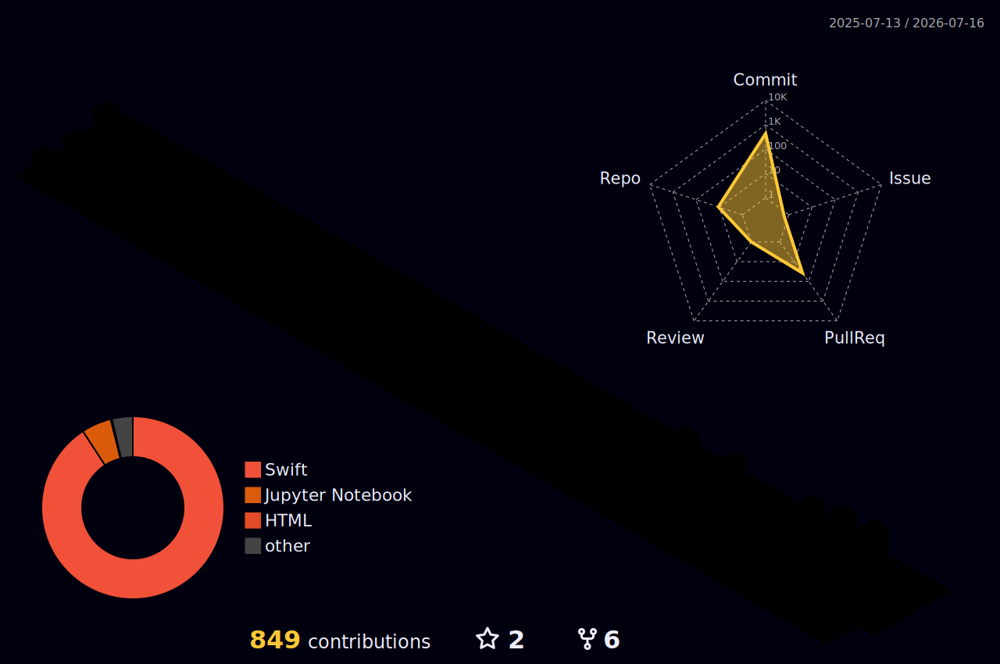

<div align="center">


<br/>

[](https://github.com/EnzoFerroni)
[](https://linkedin.com/in/enzoferroni)


</div>

---

## 👨‍💻 Who am I?

```swift
let enzo = Developer(
    name:      "Enzo Ferroni",
    education: "Information Systems & Data Science @ Mackenzie",
    community: "Apple Developer Academy",
    focus:     ["iOS", "Swift", "AI/ML"],
    currently: "Building cool apps for iOS"
)
```

---

## 🛠️ Tech Stack

<div align="center">

**Mobile**

<div align="center">

[](https://skillicons.dev)

</div>

**Frontend**

[](https://skillicons.dev)

**Backend**

[](https://skillicons.dev)

**Databases**

[](https://skillicons.dev)

**Cloud & DevOps**

[](https://skillicons.dev)

**Data & AI**

[](https://skillicons.dev)

**Editors & Version Control**

[](https://skillicons.dev)

**Shell & Operating Systems**

[](https://skillicons.dev)

**Design & Testing**

[](https://skillicons.dev)

**Community & Docs**

[](https://skillicons.dev)

</div>

---

## 📌 Featured Projects

<div align="center">

<!-- Swap PLACEHOLDER values for owner/repo. Works with forks and org repos. -->
<a href="https://github.com/EnzoFerroni/PLACEHOLDER-1">
  
</a>
<a href="https://github.com/EnzoFerroni/PLACEHOLDER-2">
  
</a>

</div>

---

## 📈 Metrics

<div align="center">



</div>

---

## 📊 Contributions

<div align="center">




</div>


